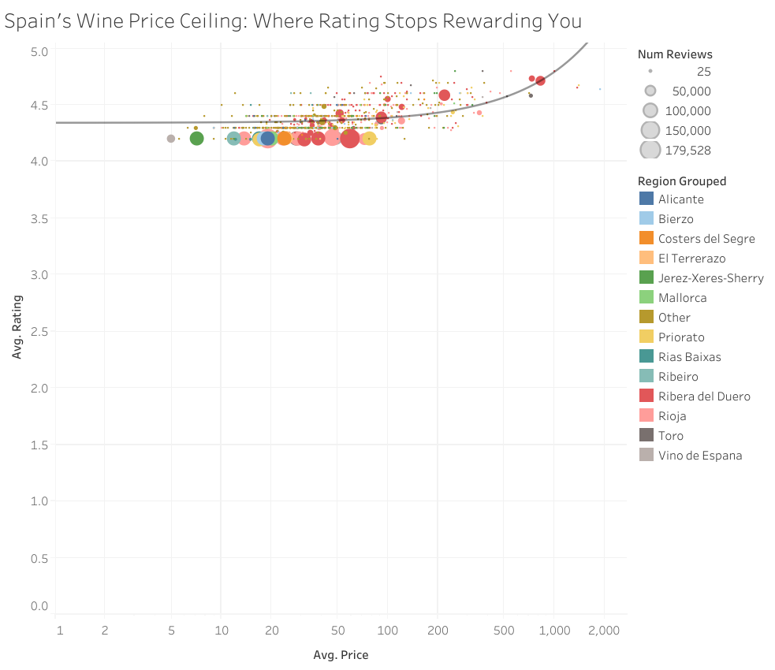

# Spain's Wine Price Ceiling: Where Rating Stops Rewarding You

**[View the live interactive dashboard on Tableau Public →](https://public.tableau.com/views/SpanishWineValueAnalysis/SpainsWinePriceCeilingWhereRatingStopsRewardingYou)**



## The Question

Does a higher price actually get you a better-rated Spanish wine — or are some regions
quietly overdelivering while others charge a premium for the same quality?

## The Approach

- **Dataset:** [Spanish Wine Quality Dataset](https://www.kaggle.com) (Kaggle), ~7,500 wines
  with price, critic rating, region, and review count
- **Cleaning:** grouped the 63 smallest wine regions into "Other" to keep the chart readable,
  flagged non-vintage wines instead of dropping them, and added a log-scaled price field to
  handle the wide price range (€5–€3,119). Full cleaning script in [`cleaning/clean_data.py`](cleaning/clean_data.py).
- **Tool:** Tableau Public

## The Finding

Across most of the price range — roughly €5 to €300 — average rating barely moves,
holding steady around 4.2–4.4 regardless of price. It's only once you cross into
luxury pricing (€300+) that ratings climb meaningfully, up toward 4.7–4.9. In plain
terms: for the vast majority of Spanish wines in this dataset, paying more doesn't
buy you a meaningfully better rating — it's only at the very top of the market that
price and quality actually move together.

## What This Shows

This project was built to demonstrate:
- Working with a real, imperfect dataset (missing years, skewed pricing, uneven region sizes)
  and making explicit, documented cleaning decisions
- Choosing a visual form that fits the data's actual shape, not a default chart type
- Turning a dataset into a specific, answerable business question rather than just
  describing what's in it

## Repo Structure
```
wine-value-analysis/
├── README.md
├── data/
│   ├── wines_SPA_raw.csv
│   └── wines_SPA_cleaned.csv
├── cleaning/
│   └── clean_data.py
└── images/
    └── final_viz.png
```
